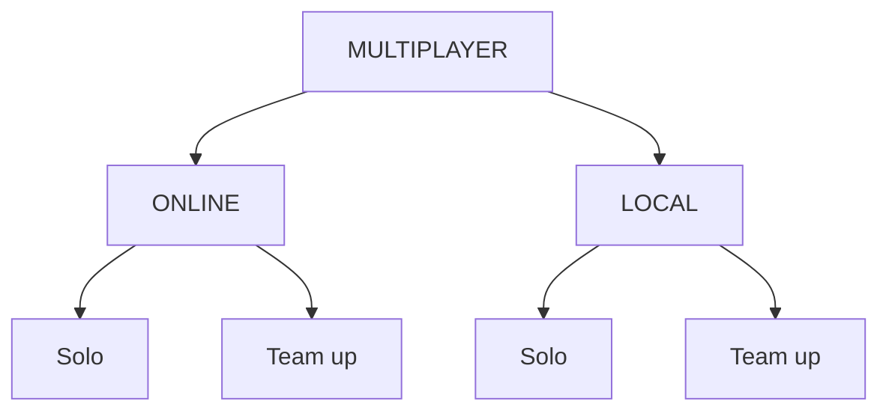

# 🔥 Game Idea: "REACTOR RUNAWAYS" (Action + Logic Puzzle)

A cooperative-competitive hybrid where players race through a collapsing reactor, solving puzzles to open paths while sabotaging or helping each other. You're an ex-military hacker like Jackie Chan infiltrating a rogue AI-controlled nuclear facility. The AI has sealed all exits with logic-based security puzzles. Run, hide, and survive the reactor meltdown, then solve puzzles to unlock doors, disable security, and escape.

🧩 GAMEPLAY LOOP 
```
ACTION PHASE → Find Safe Room → PUZZLE PHASE → Unlock Path → Repeat
       (3-5 minutes)          (2-3 minutes)
```

# 🎯 3 GAME MODES (Bot Mode, Online Multiplayer, Local Multiplayer)

1. BOT MODE (Training Mode)

- Players: 1, Many Bots
- Style: Story-driven, escape-focused
- Goal: Defeat all bots, Solve puzzles, Escape the reactor alone.

Features:

- 3 story levels(Action + Puzzle)
```
Level 1(THE TRAINING FACILITY): You v/s Bot1 Fist Fight(Martial Arts) ... If you win -> Solve Easy lvl Puzzle -> You get a Sword -> Level 2
Level 2(THE REACTOR CORE): You v/s Bot2(Stronger Bot)  ... If you win -> Solve Medium lvl Puzzle -> You get a Gun -> Level 2
Level 3(THE AI NEXUS): You v/s Bot3(Strongest Bot)  ... If you win -> Solve Hard lvl Time based Puzzle -> Ultimate Win

- You can revive 3 times in each level
```



2. ONLINE MULTIPLAYER

- Players: 4-8 online
- Style: Competitive co-op battle royale
- Goal: `Solo` - Be among the first 3 to escape; `Team` - Survive to make your team win.

Features:
- Voice chat optional
- Seasonal rewards

3. LOCAL MULTIPLAYER 

- Players: 5-10 on a same network
- Style: Co operative game with teamwork
- Goal: `Solo` - Be among the first 3 to escape; `Team` - Survive to make your team win.

Features:

Features:
- Different Roles
```
Eg: 4 PLAYERS IN ONLINE MODE

Player 1: RUNNER - Fast, can dodge drones better
Player 2: HACKER - Solves puzzles 30% faster
Player 3: SABOTEUR - Can lock doors on others
Player 4: ENGINEER - Can repair shortcuts
```

- Escape Conditions:
```
Solo - Competitive Win: Only first 3 escape (others lose)
Team - Cooperative Win: All surviving players in a Team escape
```

- Puzzle Requirement:
```
All players will have 1 component reqd to solve a puzzle.
If your partner dies, his component will be aquired by opponent team.
```


