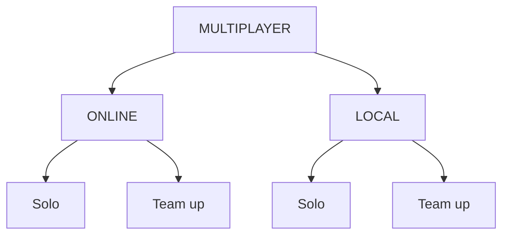

# 🔥 Game Idea: "REACTOR RUNAWAYS"

Action + Logical Puzzle Hybrid

A cooperative-competitive hybrid where players race through a collapsing reactor, solving puzzles to open paths while sabotaging or helping each other. You're an ex-military hacker infiltrating a rogue AI-controlled nuclear facility. The AI has sealed all exits with logic-based security puzzles. Run, hide, and survive the reactor meltdown, then solve puzzles to unlock doors, disable security, and escape.

🧩 GAMEPLAY LOOP 
```
ACTION PHASE → Find Safe Room → PUZZLE PHASE → Unlock Path → Repeat
       (3-5 minutes)          (2-3 minutes)
```

# 🎯 3 GAME MODES (Solo, Online Multiplayer, Local Multiplayer)

1. With Computer MODE

- Players: 1
- Style: Story-driven, escape-focused
- Goal: Escape the reactor alone, solving all puzzles yourself

Features:

10 story levels

Unlockable lore documents

Difficulty settings

Leaderboards for fastest escape times



2. ONLINE MULTIPLAYER

- Players: 4-8 online
- Style: Competitive co-op battle royale
- Goal: Be among the first 3 to escape; sabotage others

Features:

Matchmaking with random players

Voice chat optional

Ranked & casual modes

Seasonal rewards

3. LOCAL MULTIPLAYER (2-4 Players)
"Couch Meltdown"

Players: 2-4 on same device/screen

Style: Party game with teamwork & betrayal

Goal: Escape together or betray friends

Features:


